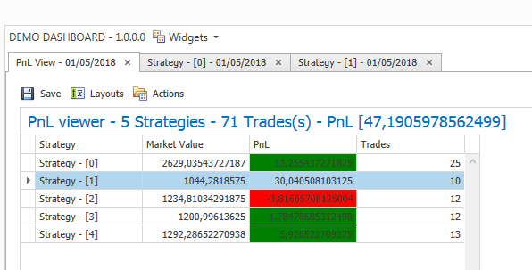
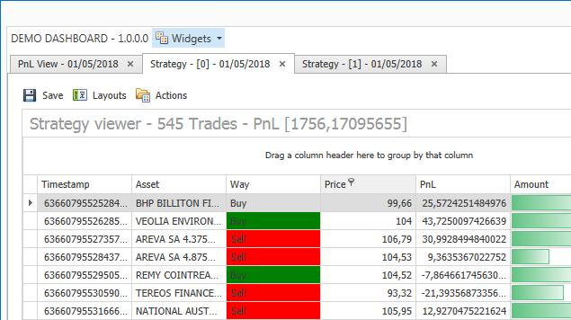

# DxDashboard

A framework on top of WPF DevExpress controls, for building dashboard like apps (workspaces, widgets with layout and content persistance, widget discovery etc...).
At the time, tightly coupled to [ReactiveUI](https://github.com/reactiveui/ReactiveUI) and [StructureMap](https://github.com/structuremap/structuremap)

# 

# 
